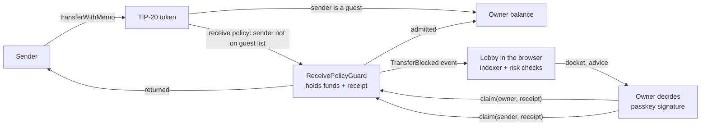

# Lobby

**A front desk for incoming stablecoin payments, built on [Tempo](https://tempo.xyz) receive policies.**
Payments from senders you don't know wait in a lobby until you let them in. Everything is signed by your own
account, there is no server, and nobody holds your keys.

> Built for the Colosseum **Crypto World's Fair** hackathon (Tempo track). Runs on the Tempo testnet.

**Live demo:** _(link added after deployment)_ · **Demo video:** _(link added after recording)_

## The problem

On an EVM chain anyone can send anything to any address, and you cannot refuse it. That is what makes
**address poisoning** work: an attacker mines an address that starts and ends like one of your counterparties,
sends you a worthless transfer, and waits for you to copy the "familiar" address from your history. It is a
known, recurring attack that works because the receiver has no say. Unsolicited tokens and spam payments are the same
weakness at lower stakes.

## What Lobby does

Tempo's T6 upgrade lets an account declare **who may pay it** (TIP-403 receive policies). A payment from
somebody else is not rejected and not credited: it is **held** by the protocol's `ReceivePolicyGuard` together with
a receipt, until the account's *recovery authority* releases it to the owner or sends it back.

Lobby is the interface that makes this usable:

| | |
|---|---|
| **Awaiting admission** | Every held payment as a docket: amount, sender, reference, and what looks off about it. |
| **Look-alike detection** | The sender is compared with your guest list **and with every address you ever paid** (read from your outgoing transfers). Shared first and last characters are highlighted side by side. |
| **One-click decisions** | *Admit*, *Admit & remember* (whitelists the sender in the same atomic transaction) or *Turn away* (returns the money). |
| **Invoices** | A payment that quotes an open invoice number and the exact amount is recommended for admission. Pay links (`#/pay?to=…&amount=…&ref=…`) fill everything in for the customer. |
| **Sender page** | Asks the network *before* paying whether the payment will be credited or held, then follows it to the end (held → admitted / returned). A normal transfer to a protected account succeeds on-chain and still does not arrive; this page tells the sender. |
| **Books** | One CSV with every payment, the decision, and the transactions that prove it. |
| **Stage directions** | Throwaway testnet wallets play a regular, a newcomer and an address-poisoning impostor, so anyone can see the whole story in a minute. |

## Non-custodial by design

There is no backend. The app is a static site that reads the chain directly from the public RPC and writes with
the visitor's own account (a passkey, or a throwaway key for browsers without passkey support).



* The owner's own account is the policy's **admin** (guest list) and **recovery authority** (releases held funds).
* "Admit & remember" is a single Tempo transaction with two calls (whitelist + claim): one signature, all or nothing.
* State that matters lives on chain. Names, invoices and a cache stay in the browser's local storage. On a fresh
  device the lobby is found again through the registry (`receivePolicy(account)`) and the held payments are read
  back from the guard's events; only names and invoices are lost.

## Threat model

What Lobby protects, what it does not, and what it assumes.

| Threat | Handling |
|---|---|
| **Address poisoning** with dust from a look-alike | The transfer is held, never credited. It is flagged *high* if it shares at least 3 leading and 3 trailing hex characters with a guest or any address you paid, and shown next to the real one. Attacks that match more characters at each end are a subset of what is caught. |
| **Unknown senders / spam** | Held by default (whitelist policy). Nothing reaches your balance without your decision. |
| **Unsolicited tokens** | The receive policy applies to every TIP-20 token. Held payments in any token are listed and flagged; only AlphaUSD can settle an invoice. |
| **Mistaken payments** | Turn away returns the money to the sender in one transaction. |
| **Attacker spams many tiny payments** | They cost the attacker fees and sit harmlessly in the guard. The UI lists them; bulk "turn away" is not built yet. |
| **Stolen device / passkey** | Whoever can sign as the owner can admit anything, exactly as with any wallet. Lobby adds no custody and no extra power. |
| **Recovery authority** | It can release held funds to the owner, or reroute them to any authorized address. Here it is the owner's own account; a separate desk key is possible but not used. |
| **Untrusted RPC / front end** | The UI reads the public RPC. A malicious RPC could hide a payment; every item links to the explorer, and the code is open source. |

**Not covered:** payments already credited (a whitelisted guest whose key is compromised), social engineering,
and other chains. The 3+3 heuristic can miss an address that shares fewer characters, which is why unknown
senders are held regardless.

**Honest limits of this build:** testnet only; the register of direct payments only shows AlphaUSD; passkey
accounts use the SDK's local ceremony, so clearing the browser's site data loses the lookup for that passkey
(per Tempo's docs, production apps should use a server-backed key manager); the demo account is a plain key in local storage.

## Run it

```bash
pnpm install
pnpm dev          # http://127.0.0.1:5173
```

Sign in with a passkey (or "quick demo account"), get test money, open your lobby, then use *Stage directions*.

```bash
pnpm test         # 38 unit tests: risk checks, state reducer, CSV, formatting
pnpm e2e          # end-to-end against the Tempo testnet, no browser: setup → payments → decisions → sender tracking
pnpm check        # type check
pnpm build        # static site in dist/
pnpm mine 0x…     # mine a look-alike address for a target (demo helper)
```

`pnpm e2e` uses the testnet faucet and takes about a minute. The demo cast in `src/lib/fixtures.ts` are throwaway
**testnet** keys published on purpose; never send real funds to them.

## Code map

```
src/lib/risk.ts       look-alike, dust, invoice and token checks → flags + recommendation
src/lib/state.ts      pure reducer: chain activity → lobby state (idempotent)
src/lib/indexer.ts    reads guard/token/registry events, finds a lobby from the registry getter
src/lib/actions.ts    setup, admit, turn away, guest list, preflight, payment (viem, runs in browser and Node)
src/lib/track.ts      follows a sent payment through held → admitted / returned
src/lib/network.ts    chain config and an RPC transport that retries rate-limited requests safely
src/ui/               React components: Desk, Docket, Pay, Setup, Connect, Stage
tools/e2e.ts          testnet end-to-end check
```

## Roadmap

* Automatic rules (return look-alikes after a day, admit exact invoice matches) with a separate, limited desk key.
* Team approvals using Tempo admin access keys; two-person rule above a threshold.
* Server-backed passkey key manager, Tempo mainnet (the receive-policy precompiles are live there).
* Webhooks and e-mail when a payment enters the lobby.

## License

MIT
